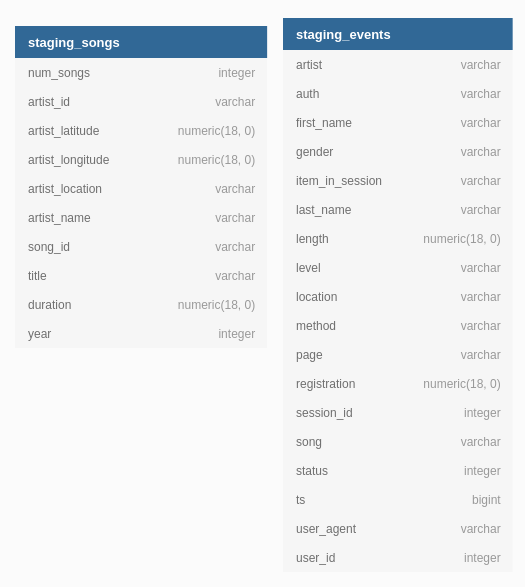
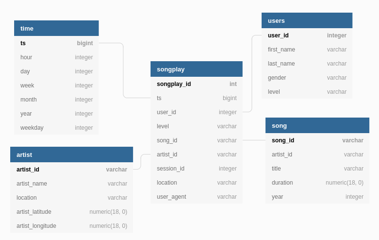

# cloud-data-warehouse or SCEP: Sparkify Cloud ETL pipeline
SCEP is a project for an imaginary music streaming startup called Sparkify. Sparkify has grown their user base and song database and want to move their processes and data onto the cloud. SCEP build an ETL pipeline that extracts their data from S3, stages them in Redshift, and transforms data into a set of dimensional tables for their analytics team

# SCEP files:
the SCEP project includes six files but four files are required to run the script.
* dwh.cfg - Necessary - Data Warehouse config file. you must edit this
* sql_queries.py - Necessary - contains all sql queries
* create_table.py - Necessary - create fact and dimension tables for the star schema in Redshift.
* etl.py - Necessary - load data from S3 into staging tables  and process that data into the five fact\dimension tables on Redshift.

* README.md
* test.ipynb 

# Prerequisites
All libraries you need to install:
* pandas
* configparser
* psycopg2
* sql_queries
* json

# How to create the database using SCEP:
First, we need edit dwh.cfg file.
Second, create the database:
`python create_tables.py`
Third, run:
`python3 etl.py`
 
